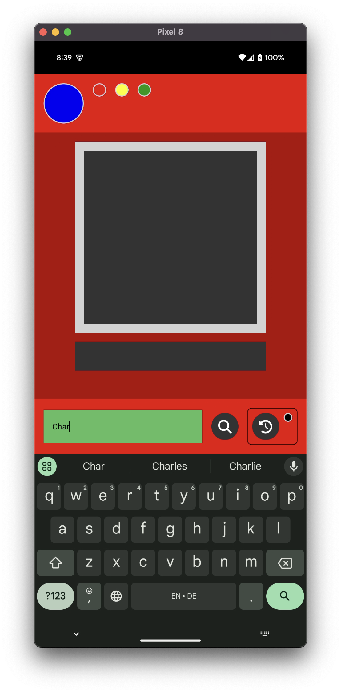
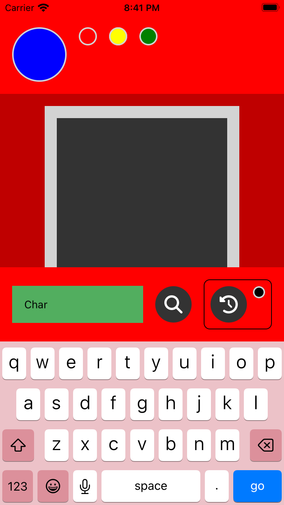
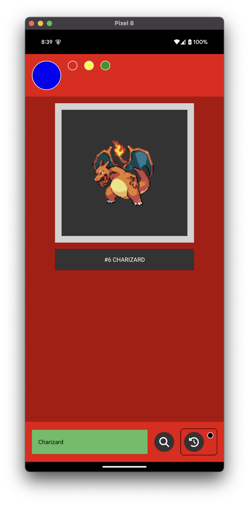
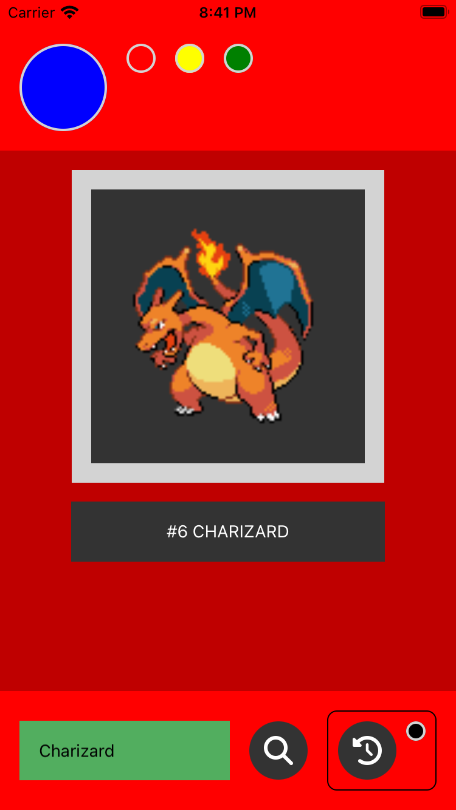
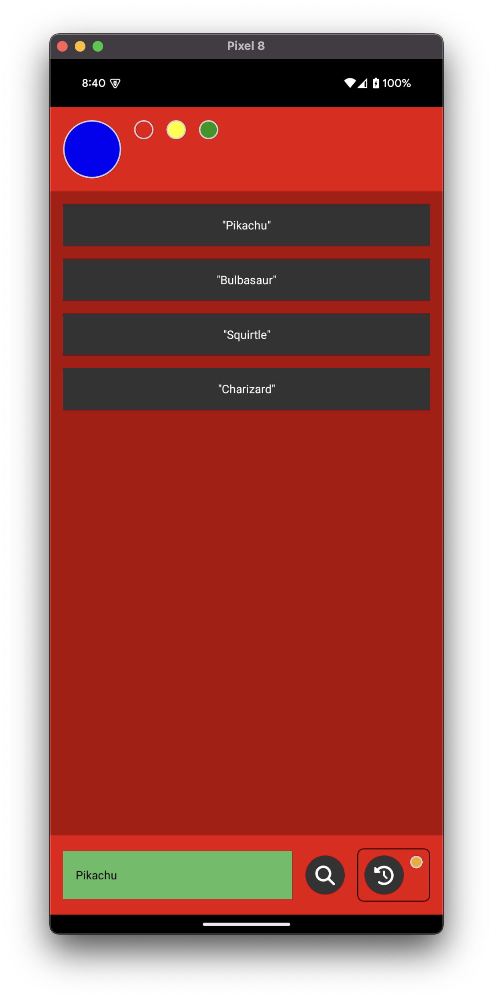
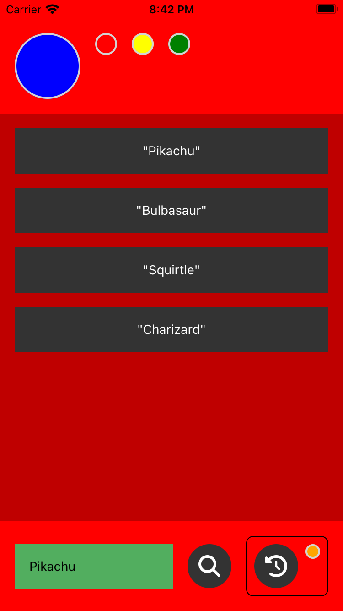

# Pokedex

A Pokedex mobile app written in React Native.

## Table of Contents

- [Screenshots](#screenshots)
- [Getting Started](#getting-started)
  - [Step 1: Install Dependencies](#step-1-install-dependencies)
  - [Step 2: Start the Metro Server](#step-2-start-the-metro-server)
  - [Step 3: Start the Application](#step-3-start-the-application)
- [Formatting](#formatting)
- [Linting](#linting)
- [Testing](#testing)
- [Type-checking](#type-checking)
- [Troubleshooting](#troubleshooting)

## Screenshots

### Searching

<table>
  <tr>
    <th>Android</th>
    <th>iOS</th>
  </tr>
  <tr>
    <td></th>
    <td></th>
  </tr>
</table>

### Search Result

<table>
  <tr>
    <th>Android</th>
    <th>iOS</th>
  </tr>
  <tr>
    <td></th>
    <td></th>
  </tr>
</table>

### Search History

<table>
  <tr>
    <th>Android</th>
    <th>iOS</th>
  </tr>
  <tr>
    <td></th>
    <td></th>
  </tr>
</table>

## Getting Started

> **Note**: Make sure you have completed the [React Native - Environment Setup](https://reactnative.dev/docs/environment-setup) instructions 'til "Creating a new application" step, before proceeding.

### Step 1: Install Dependencies

First, you will need to install necessary dependencies. Run the following command from the _root_ of the project to install JavaScript dependencies:

```bash
npm install
```

Once the JavaScript dependencies are installed, run the following commands to install native iOS dependencies:

```bash
cd ios
bundle install
bundle exec pod install
```

### Step 2: Start the Metro Server

Once all dependencies are installed, you will need to start **Metro**, the JavaScript _bundler_ that ships _with_ React Native. Run the following command from the _root_ of the project to start Metro:

```bash
npm start
```

### Step 3: Start the Application

Let Metro Bundler run in its _own_ terminal. Open a _new_ terminal from the _root_ of the project. Run the following command to start the _Android_ or _iOS_ app:

#### For Android

```bash
npm run android
```

#### For iOS

```bash
npm run ios
```

If everything is set up _correctly_, you should see the app running in the _Android Emulator_ or _iOS Simulator_ shortly provided you have set up your emulator/simulator correctly.

This is one way to run the app — you can also run it directly from within Android Studio and Xcode respectively.

## Formatting

Code formatting is managed by [Prettier](https://prettier.io/).

Check that the code adherees to the formatting standards with the following command:

```bash
npm run check-format
```

Format violations automatically with the following command:

```bash
npm run format
```

## Linting

Linting is managed by [ESLint](https://eslint.org/).

Check for violations with the following command:

```bash
npm run lint
```

## Testing

Automated tests are run via [Jest](https://jestjs.io/).

Run tests with the following command:

```bash
npm test
```

## Type-checking

Type-checking is powered by [TypeScript](https://www.typescriptlang.org/).

Check for type violations with the following command:

```bash
npm run tsc
```

## Troubleshooting

### iOS

If you run into the following error while trying to build the project with Xcode,

```
React-rncore: PhaseScriptExecution failed with nonzero exit code
```

ensure a _ios/.xcode.env.local_ file exists which exports the path to your Node.js binary.

```bash
export NODE_BINARY="/path/to/node"
```

### Other

If you run into issues, check out the [React Native troubleshooting](https://reactnative.dev/docs/troubleshooting) page.
